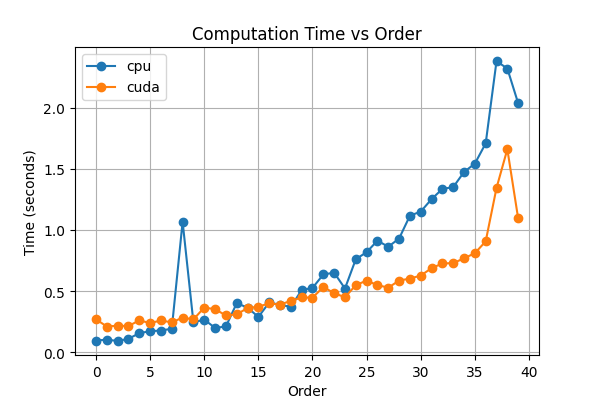

# TORCWA

***TORCWA*** (**torc**h + **rcwa**) is a PyTorch implementation of rigorous coupled-wave analysis (RCWA)

## Table of Contents

- [Key Features](#key-features)
- [Getting Started](#getting-started)
- [Usage](#usage)
- [Compute time vs number of orders](#compute-time-vs-number-of-orders)

## Key Features

- **GPU-accelerated** simulation
- Supporting **automatic differentiation** for optimization
- Units: Lorentz-Heaviside units
	* Speed of light: 1
	* Permittivity and permeability of vacuum: both 1
- Notation: exp(-*jωt*)

## Getting Started

### Prerequisites

Ensure you have the following installed:

- Python 3.7 or higher
- Required libraries (listed in `requirements.txt`)

### Installation

Clone the repository:

```bash
git clone https://github.com/Alexin-CH/TORCWA.git
cd TORCWA
```

Install the required dependencies:

``` bash
make
```

## Usage

Import the package and build a simulation. The setup order is:

1. Create the `rcwa` simulation object (frequency, Fourier orders, lattice constants)
2. Optionally add input/output layers
3. Set the incident angle
4. Add internal layers
5. Set the incident field (plane wave or Fourier amplitudes)
6. Solve the global S-matrix
7. Query S-parameters or field distributions

```python
import torch
import torcwa

# Wavelength 800 nm, 3x3 diffraction orders, 1000 nm lattice
sim = torcwa.rcwa(
    freq=1.0 / 800.0,
    order=(1, 1),
    lattice=(1000.0, 1000.0),
)

sim.add_input_layer(eps=1.0)        # free-space input
sim.add_output_layer(eps=1.0)       # free-space output
sim.set_incident_angle(inc_ang=30.0 * torch.pi / 180, azi_ang=0.0)

# Homogeneous slab: thickness 100 nm, eps = 2.25 (n = 1.5)
sim.add_layer(thickness=100.0, eps=2.25, mu=1.0)

# Incident plane wave (x-polarized, forward direction)
sim.source_planewave(amplitude=[1.0, 0.0], direction="f")

# Solve the global S-matrix
sim.solve()

# Power-normalized S-parameters for the (0, 0) order
R = sim.s_parameters(orders=[0, 0], direction="forward",
                     port="reflection", polarization="xx")
T = sim.s_parameters(orders=[0, 0], direction="forward",
                     port="transmission", polarization="xx")
print(f"R = {R.item():.4f}, T = {T.item():.4f}")

# Field distribution in the XY plane inside the first layer (z = 0)
x = torch.linspace(-500.0, 500.0, 64)
y = torch.linspace(-500.0, 500.0, 64)
(Ex, Ey, Ez), (Hx, Hy, Hz) = sim.field_xy(0, x, y, z_prop=0.0)
```

Supported polarizations for `s_parameters`: xy-notation `'xx'`, `'yx'`, `'xy'`,
`'yy'` and ps-notation `'pp'`, `'sp'`, `'ps'`, `'ss'`.

## Compute time vs number of orders

To evaluate the compute time as a function of the number of orders, run `torcwa/eval_orders.py` as a script:

```bash
python torcwa/eval_orders.py
```

