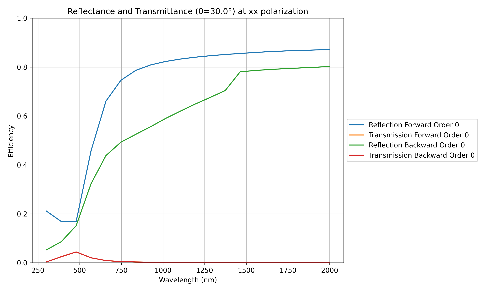
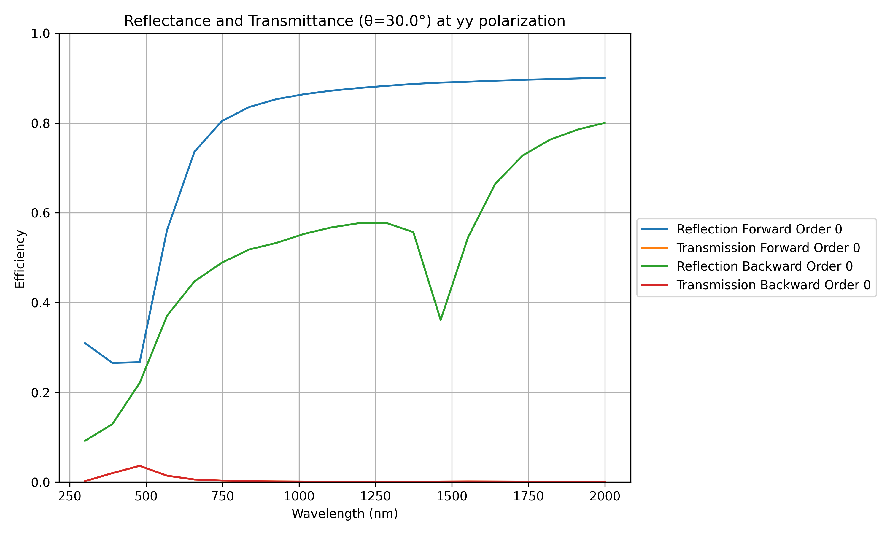
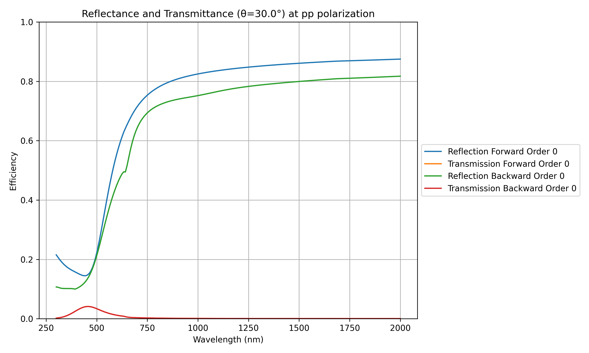
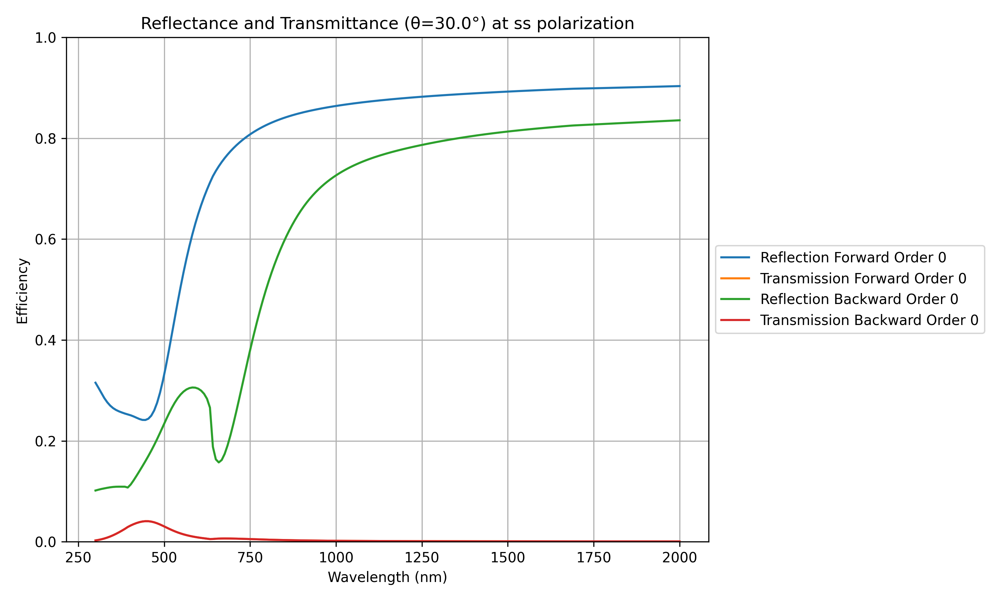
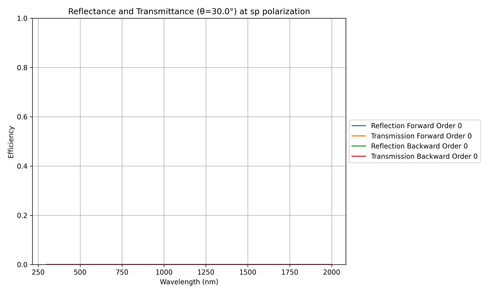
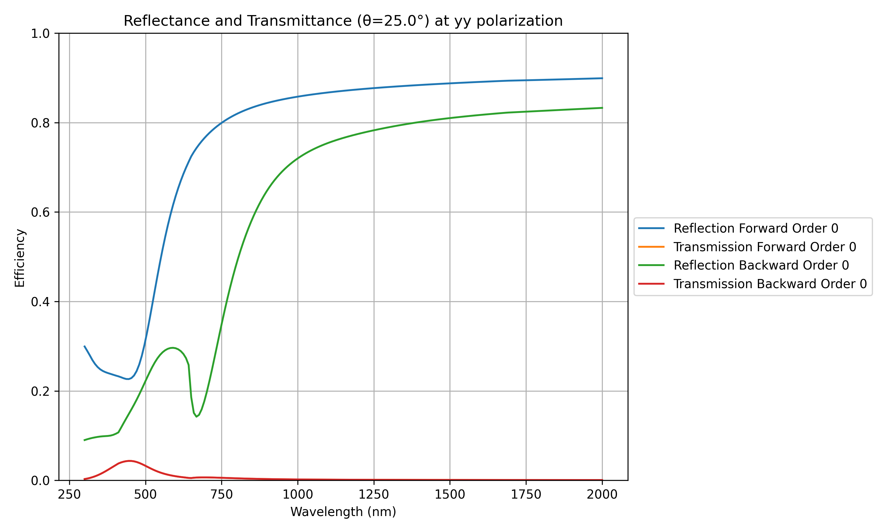
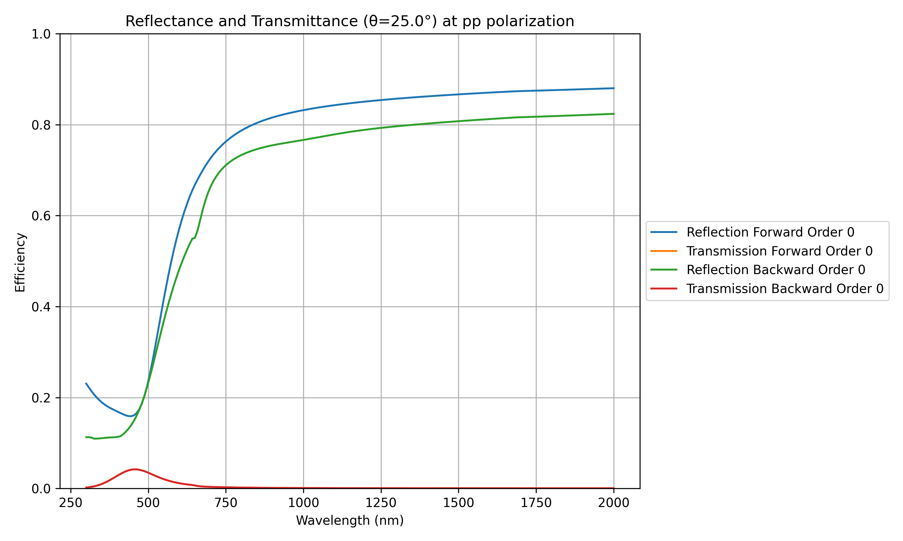
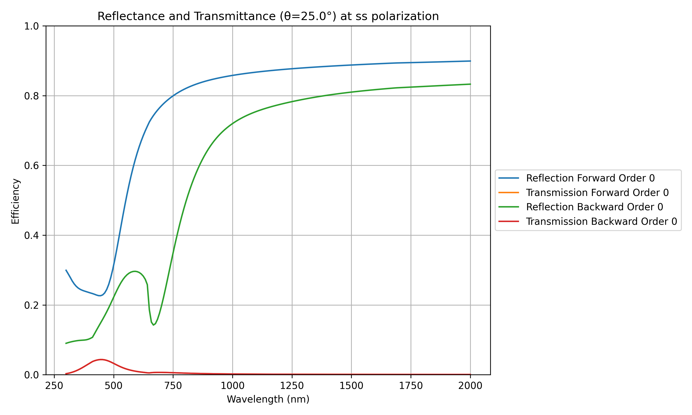

# SinTiN TORCWA Simulations

Simulation of the optical response of diffractive structures using TORCWA.

Here the structure is a sine grating of TiN on a SiO2 substrate.

## Eval orders :

Here only need to set y order as this is a 1D grating

* * *
* * *

## Simulation n°1 : Sine grating of TiN on SiO2 substrate, period 1000 nm, height 110 nm, incident angle 30°

### Table of parameters :

| Parameter               | Value     | Unit          | Description                                     |
|-------------------------|-----------|---------------|-------------------------------------------------|
| Wavelength range        | 500-2000  | nm            | Wavelength sweep range                          |
| Incident angle          | 30        | °             | Angle of incidence                              |
| Grating period          | 1000      | nm            | Period of the sine grating                      |
| Grating height          | 110       | nm            | Height of the sine grating (amplitude is 55 nm) |

### 0th order response

| xx polarization at 30° incidence            | yy polarization at 30° incidence            |
|---------------------------------------------|---------------------------------------------|
|   |   |

| xy polarization at 30° incidence            | yx polarization at 30° incidence            |
|---------------------------------------------|---------------------------------------------|
|   |   |

* * *

| pp polarization at 30° incidence            | ss polarization at 30° incidence            |
|---------------------------------------------|---------------------------------------------|
|   |   |

| ps polarization at 30° incidence            | sp polarization at 30° incidence            |
|---------------------------------------------|---------------------------------------------|
|   |   |

* * *
* * *

## Simulation n°2 : Sine grating of TiN on substrate (n=1.5), period 450 nm, height 90 nm, incident angle 30°

### Table of parameters :

| Parameter               | Value     | Unit          | Description                                     |
|-------------------------|-----------|---------------|-------------------------------------------------|
| Wavelength range        | 500-2000  | nm            | Wavelength sweep range                          |
| Incident angle          | 30        | °             | Angle of incidence                              |
| Grating period          | 450       | nm            | Period of the sine grating                      |
| Grating height          | 90        | nm            | Height of the sine grating (amplitude is 45 nm) |

### 0th order response

| xx polarization at 30° incidence            | yy polarization at 30° incidence            |
|---------------------------------------------|---------------------------------------------|
|   |   |

| xy polarization at 30° incidence            | yx polarization at 30° incidence            |
|---------------------------------------------|---------------------------------------------|
|   |   |

* * *

| pp polarization at 30° incidence            | ss polarization at 30° incidence            |
|---------------------------------------------|---------------------------------------------|
|   |   |

| ps polarization at 30° incidence            | sp polarization at 30° incidence            |
|---------------------------------------------|---------------------------------------------|
|   |   |

* * *
* * *

## Simulation n°3 : Sine grating of TiN on substrate (n=1.5), period 450 nm, height 90 nm, incident angle 25°

### Table of parameters :
| Parameter               | Value     | Unit          | Description                                     |
|-------------------------|-----------|---------------|-------------------------------------------------|
| Wavelength range        | 500-2000  | nm            | Wavelength sweep range                          |
| Incident angle          | 25        | °             | Angle of incidence                              |
| Grating period          | 450       | nm            | Period of the sine grating                      |
| Grating height          | 90        | nm            | Height of the sine grating (amplitude is 45 nm) |

### 0th order response

| xx polarization at 25° incidence            | yy polarization at 25° incidence            |
|---------------------------------------------|---------------------------------------------|
|   |   |

| xy polarization at 25° incidence            | yx polarization at 25° incidence            |
|---------------------------------------------|---------------------------------------------|
|   |   |

* * *

| pp polarization at 25° incidence            | ss polarization at 25° incidence            |
|---------------------------------------------|---------------------------------------------|
|   |   |

| ps polarization at 25° incidence            | sp polarization at 25° incidence            |
|---------------------------------------------|---------------------------------------------|
|   |   |

